# Firefox Data Stores

# TL;DR

1. Firefox desktop has 45 separate data stores. In contrast Firefox for iOS has 5 and Firefox for Android has 2.

2. Only 9 shared domain objects can be found on all 3 platforms. One of those, favicons, is present but not synced at all. 

3. Firefox desktop has an entire SQLite database, Storage.sqlite, that contains no tables. It is used entirely to reference the schema version value and uses that value to create the version number for the Storage directory.

4. Firefox desktop stores well over 1000 preferences in a single, synchronously accessed file. This file is read from and written to from all over the application. Every single write will cause the entire file to be written to disk.

5. Firefox for desktop utilises 10 different data storage formats. These are

  1. SQLite
  2. Indexeddb
  3. Extensionless character delimited files (AlternateServices, SiteSecurityServices, SecurityPreloadState)
  4. JSON
  5. .ini
  6. .txt
  7. .dat
  8. .rdf
  9. .xml
  10. .js (prefs, sessionstore)

6. 3 data stores contain only one item of information.

  1. Times.json
  2. datareporting/state.json
  3. healthreport/state.json

7. Of the data fields stored by desktop, only 8% of them are available to sync. Of data that is synced, desktop syncs 95% of fields, Android 90% and iOS 86%. 

# Desktop Data Stores

## SQlite Stores

### Places.sqlite

Places is where the vast majority of synced data is stored. This database most closely represents the database structures on iOS and Android. The only data that is synced that is not contained within places, is logins, add-ons (only desktop), prefs (only desktop), clients (synthetic), open tabs, and commands (synthetic, transient).

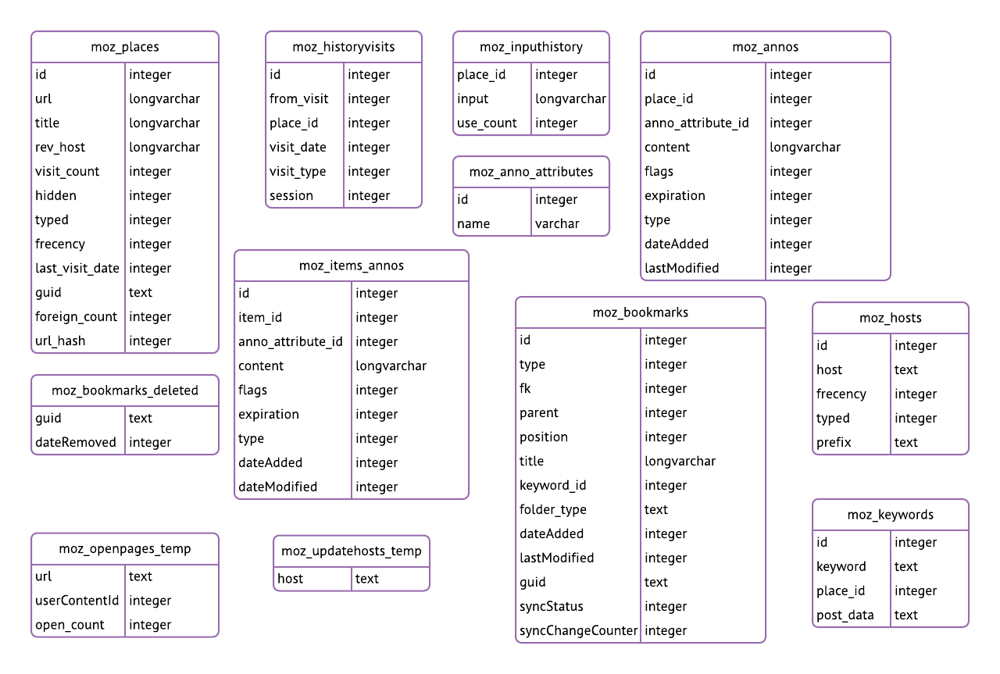

### Content-prefs.sqlite

Stores arbitrary data, or "preferences", associated with specific domains, or web "content".

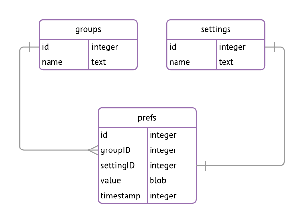

### Cookies.sqlite

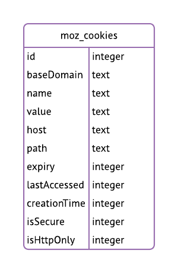

### Favicons.sqlite

Stores blob data for favicons for quick retrieval. This database is ATTACHed to places.sqlite.

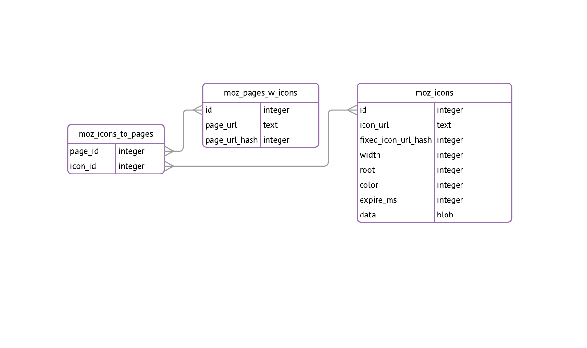

### Formhistory.sqlite

Stores data entered into forms.

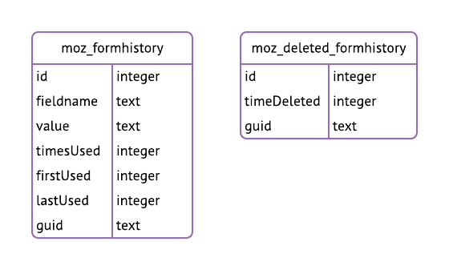

### Kinto.sqlite

Store for enabling syncing of data through Kinto.

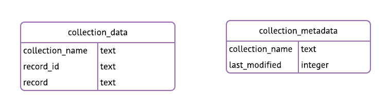

### Permissions.sqlite

Stores host, api and clipboard permissions.

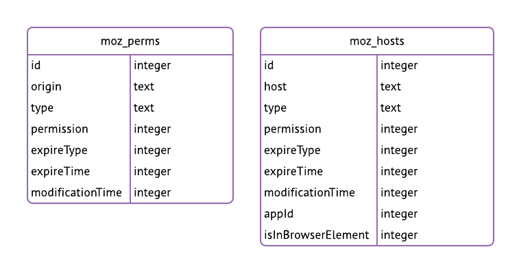

### Signons.sqlite

Stores password manager data. The data in here is a replica of that held in logins.json. The data store is also accessed on the Android browser, which also has it’s own replica table in it’s browser.db, logins. This store is no longer used actively and is only kept around for migration purposes.

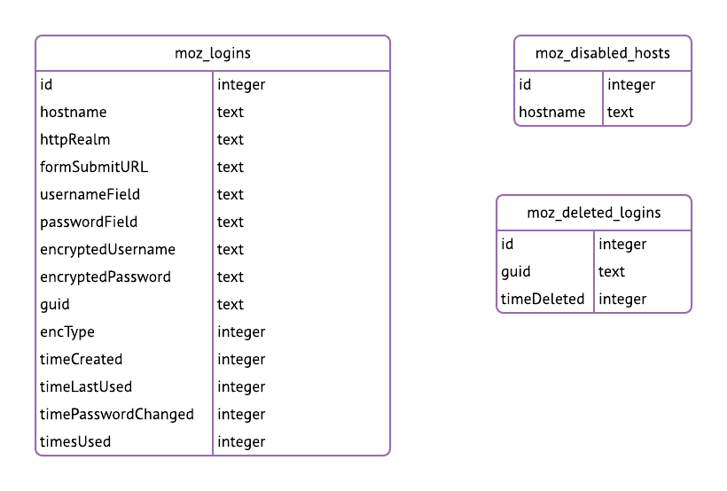

### Storage.sqlite

Storage.sqlite is a completely empty database. It is opened and the schema version number checked and that version number is used as the version number for the storage directory. The storage directory is the directory that contains all of the data store files. 

### Webappsstore.sqlite

Provides local storage for webapps.

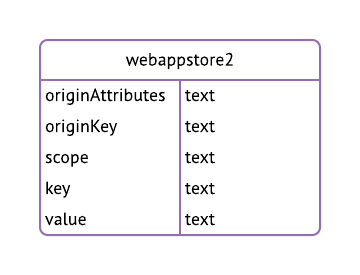

## Key Value Stores

#### AlternateServices

RFC 7838 Alternative Services. "Alt-Svc allows separation of transport routing from the origin host without using a proxy."

#### SiteSecurityServices, SecurityPreloadState

HSTS & HPKP storage

#### Secmod.db

The security module database.

#### Key3.db

Contains the key that is used to encrypt the *Firefox* passwords stored in logins.json file.

####  Cert7.db

Network Security Services DB

#### GMP/PBGP

?

#### Abouthome

The about:home snippet service is a simple, highly-cached content management service. It is intended to assemble and deliver content snippets to the about:home page in Firefox.

#### AppProjects

Data store for local apps.

#### devtools-async-storage

Simple key-value store for persisting values in devtools

#### About:reader

Stores cached article information for the about:reader page.

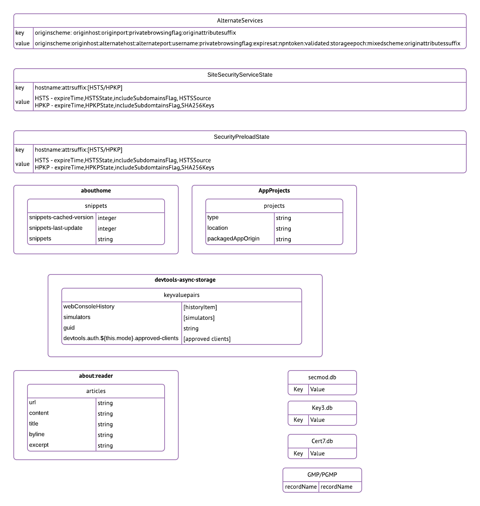

## JSON file stores

### **s****essionstore****.js/recovery.js**

Stores all browsing session state data for session restoration. 

While Firefox is running, your live session is stored in recovery.js**.  **sessionstore.js is created at shutdown. 

```json
{
  "windows": [
    {
      "tabs": [
        {
          "entries": [
            {
              "url": string,
              "title": string,
              "cacheKey": long,
              "ID": int,
              "docshellID": int,
              "referrer": string,
              "docIdentifier": int,
              "structuredCloneState": string,
              "structuredCloneVersion": int,
              "children": [
                {
                  "url": string,
                  "ID": int,
                  "docshellID": int,
                  "owner_b64": string,
                  "docIdentifier": int
                },
              ]
            }
          ],
          "lastAccessed": long,
          "hidden": bool,
          "attributes": {
          },
          "image": string,
          "index": int,
          "storage": {
            "<url>": {
              "ScribeTransport": string
            }
          },
          "formdata": {
            "xpath": {
              "<path>": string
            },
            "id": {
              "age-gate-year": {
                "selectedIndex": int,
                "value": string
              },
              "age-gate-month": {
                "selectedIndex": int,
                "value": string
              },
              "age-gate-day": {
                "selectedIndex": int,
                "value": string
              }
            },
            "url": string
          },
          "scroll": {
            "children": [
              {
                "scroll": stringint
              }
            ]
          },
        },
      "selected": int,
      "_closedTabs": [
        {
          "state": {
            "entries": [
              {
                  "url": string,
                  "title": string,
                  "cacheKey": long,
                  "ID": int,
                  "docshellID": int,
                  "referrer": string,
                  "docIdentifier": int,
                  "structuredCloneState": string,
                  "structuredCloneVersion": int,
                  "children": [
                    {
                      "url": string,
                      "ID": int,
                      "docshellID": int,
                      "owner_b64": string,
                      "docIdentifier": int
                    },
                ]
              }
            ],
            "lastAccessed": long,
            "userTypedValue": string,
            "userTypedClear": int,
            "hidden": bool,
            "attributes": {
            },
            "image": string,
            "index": int,
            "pageStyle": {
              "pageStyle": string
            },
            "scroll": {
              "scroll": string
            }
          },
          "title": string,
          "image": string,
          "pos": int,
          "closedAt": long
        }
      ],
      "busy": bool,
      "width": string,
      "height": string,
      "screenX": string,
      "screenY": string,
      "sizemode": string
    }
  ],
  "selectedWindow": int,
  "_closedWindows": [
      {
        tabs: [
          { 
            entries: [
              {
                url: string, 
                triggeringPrincipal_base64: string, 
                title: string 
              }
            ] 
          }
        ],
        selected: 2,
        title: "mozilla.org",
        _closedTabs: []
      },
  ],
  "session": {
    "lastUpdate": long,
    "startTime": long,
    "recentCrashes": int
  },
  "scratchpads": [ string ],
  "global": {
    
  }
}
```

### Addons.json

Compatible addons for this browser version.

### Containers.json

Details of the different containers currently in use.

### Xulstore.json

Stores information about toolbars, window positioning, and other interface elements in Firefox 34 and above.

### Bookmarkbackups.json

Local backup of bookmarks.

### Logins.json

Contains all the stored username and password information for password formfill. 

### Handlers.json

Details of the different services available and how to connect to them.

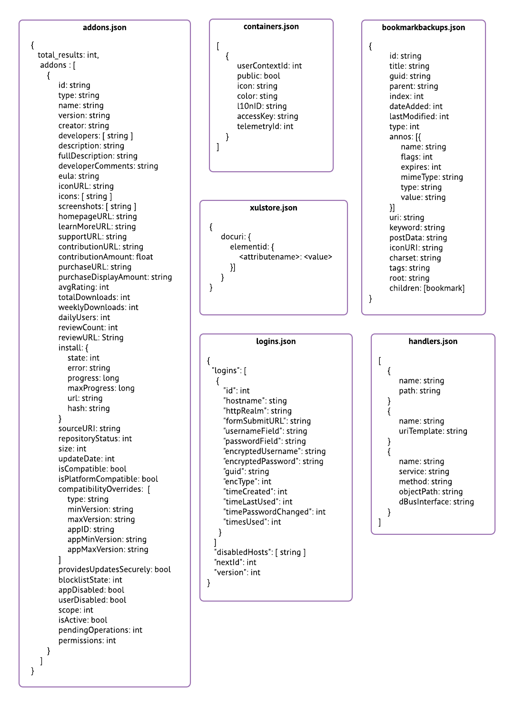

### Search.json

Contains information about all of the search engines supported by the browser. This is used by all other search UI to retrieve query and configuration information about a specific search engine. 

### signedInUser.json

Contains information about the currently signed in Firefox Accounts user.

### Extensions.json

Contains information about installed web extensions.

### Times.json

Contains the profile creation date.

### datareporting/state.json

Contains the client ID used to identify this installation for datareporting.

### healthreport/state.json

Contains the client ID used to identify this installation for the healthreport.

### sessionCheckpoints.json

Records the profile state after every notification.

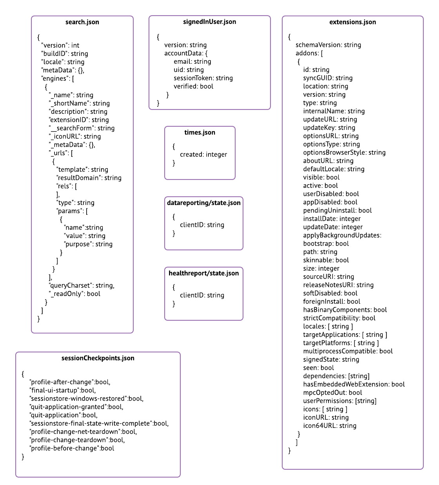

## File Based Stores.

### Compatibility.ini

Contains a snapshot of browser version information for compatibility comparison.

### Recovations.txt

Contains a list of revoked certificates.

### Persdict.dat

Contains a list of words that have been added to the browser’s dictionary.

### mimeTypes.rdf

Contains associations between MIME types and application/save preferences.

### Cert-override.txt

Contains user certificate exceptions.

### Serviceworker.txt

Contains information about installed service workers.

### Pluginreg.dat

Contains a list of installed plugins.

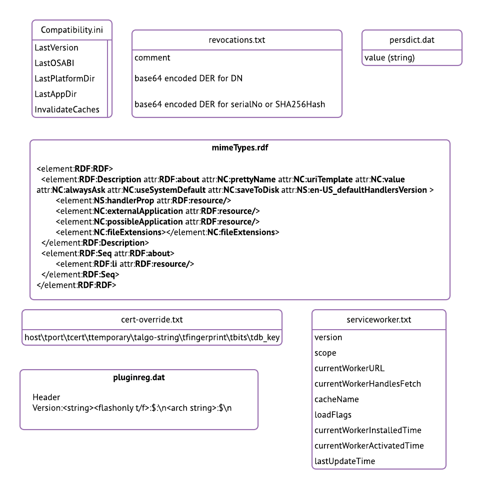

## XML file stores

### Blocklist.xml

Contains a blocklist of addons, plugins, certificates and graphics.

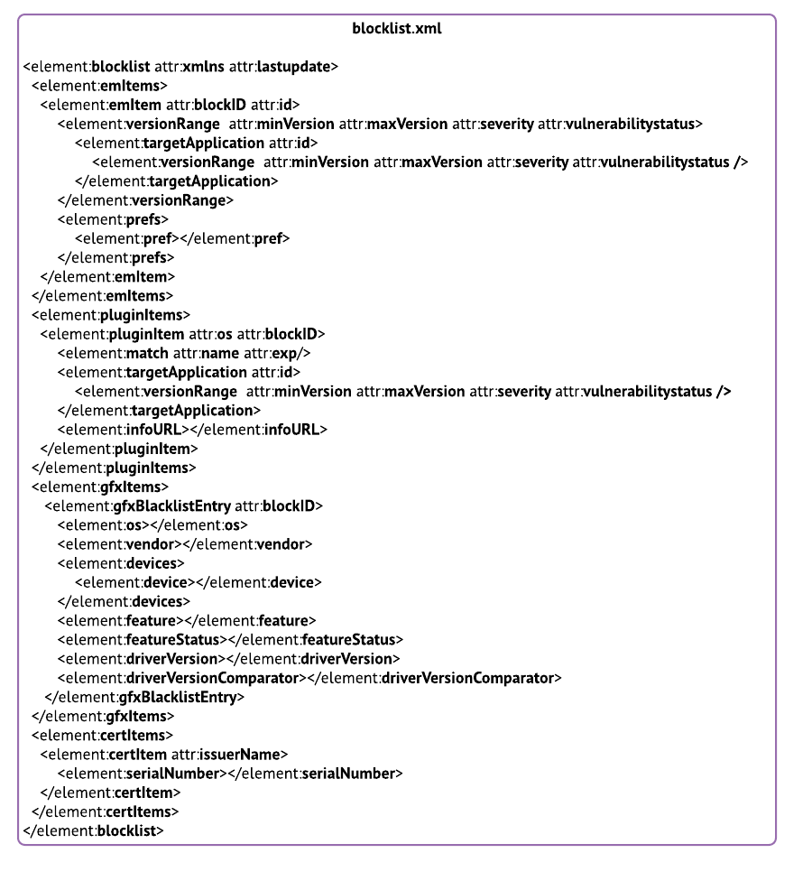

### Prefs

There are over 1000 preferences collected and stored in desktop Firefox. You can see a list of the preference keys in Appendix 1.

# Android Data Stores

### Browser.db, signedInUser.json

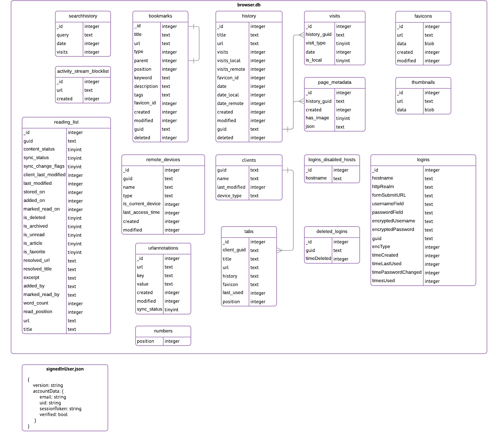

### Prefs

# iOSDataStores

### Browser.db

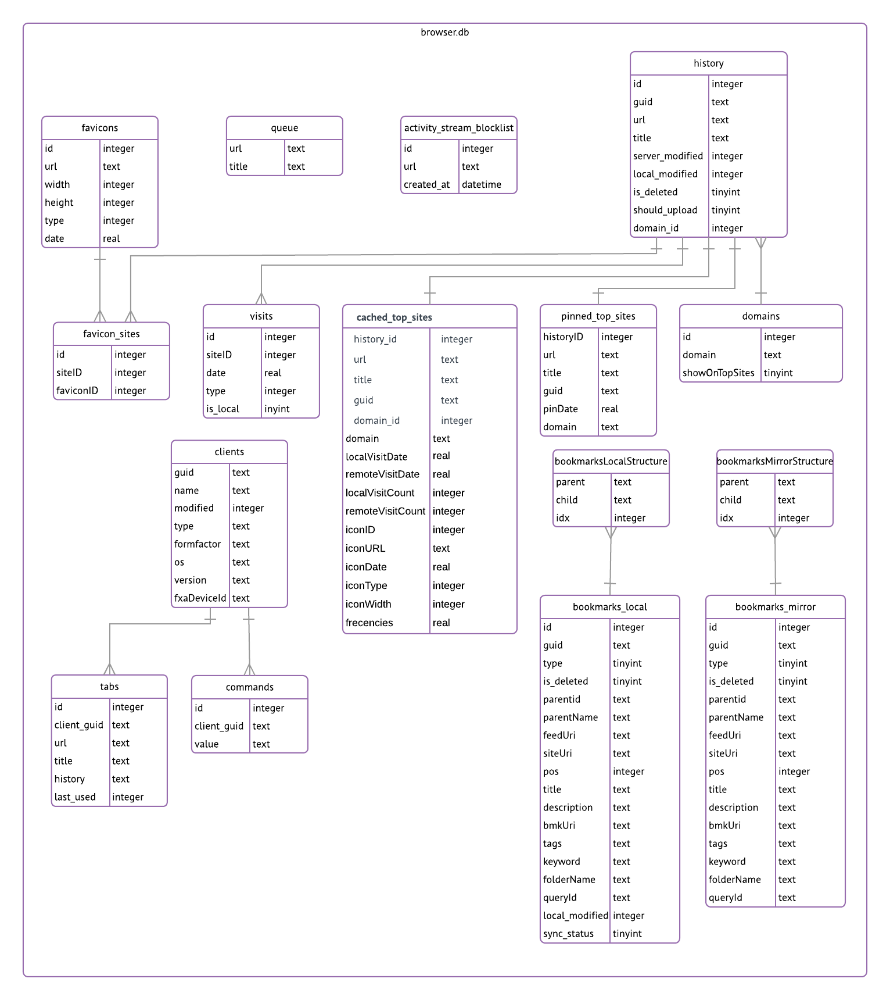

### Logins.db, Metadata.db, ReadingList.db, SignedInUser.json

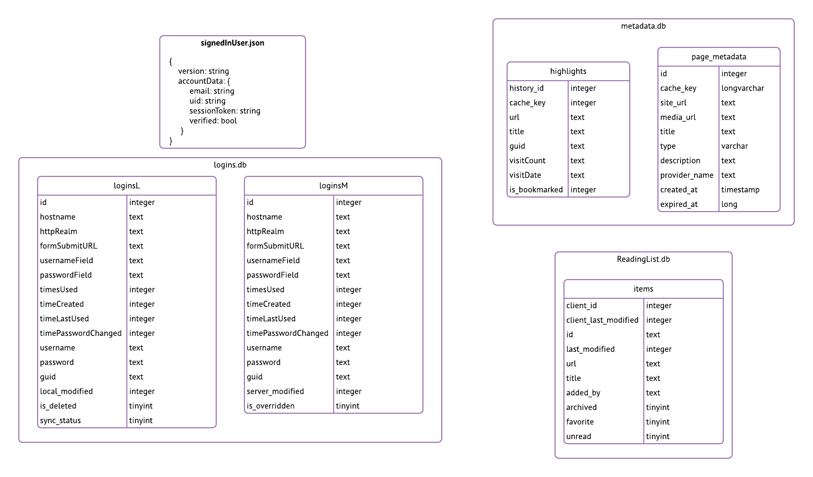

### prefs

* applicationDidRequestUserNotificationPermissionPrefKey
* backoff.storage
* baseTimestamp
* blockPopups
* bookmarkvalidationattempt
* clearprivatedata.toggles
* CompactTabLayout
* currentClient
* feature_switches.<feature_id>
* flowID
* HomePageButtonIsInMenuPrefKey
* HomePageURLPref
* ids
* initialPingSent
* IntroViewControllerSeen
* KeyDefaultHomePageURL
* lastClientUpload
* lastFetched
* lastModified
* lastRemoteTabSyncTime
* lastSyncFinishTime
* lastTabsUpload
* latestAppVersion
* MailToOption
* NewTabPrefKey
* nextOffset
* NightModeButtonIsInMenuPrefKey
* NightModeStatus
* NoImageModeButtonIsInMenuPrefKey
* NoImageModeStatus
* offsetNewer
* PrefKeyModel
* PrefKeyPingCount
* PrefKeyProfileDate
* previousClients
* readermode.style
* recentlyClosedTabs
* repair.aborted
* repair.finished
* repair.need-new-client
* repair.sent
* repair.sent-again
* repairs.bookmark
* saveLogins
* search.disabledEngineNames
* search.orderedEngineNames
* search.suggestions.show
* search.suggestions.showOptIn
* settings.allowThirdPartyKeyboards
* settings.closePrivateTabs
* settings.sendUsageData
* state
* sync.scratchpad
* timestamp
* topSites.deletedSuggestedSites
* topSitesCacheIsValid
* topSitesCacheSize

# Firefox Sync storage format 5

See also [http://docs.services.mozilla.com/sync/objectformats.html](http://docs.services.mozilla.com/sync/objectformats.html) and [https://mozilla-services.readthedocs.io/en/latest/storage/apis-1.5.html](https://mozilla-services.readthedocs.io/en/latest/storage/apis-1.5.html) .

Firefox Sync is a record-oriented system: the current state (and only the current state) of the connected devices' opted-in data is present as encrypted JSON objects on the server, keyed by a GUID. Data types correspond to collections on the server: e.g., login records are stored as objects in the passwords collection. Changes are observed by seeing a change in modified timestamp. Changes are retrieved by downloading the entirety of each modified record. New local changes are applied by uploading complete new records to the relevant collection.

See the [datatypes](https://docs.google.com/spreadsheets/d/1k9_K7Dc3q2h3SDV0vwjTgJou-ndza6WuobyJ1bbemtc/edit?ts=5977ab9d#gid=1269587388) companion document to see an overview of which data is synced between which platforms.

## meta/global

Control structure for engine selection and versioning. One per account.

```json
{
"engines" : {
"bookmarks" : {
"version" : int,
"syncID" : string
},
"forms" : {
"version" : int,
"syncID" : string
},
"tabs" : {
"version" : int,
"syncID" : string
},
"clients" : {
"version" : int,
"syncID" : string
},
"addons" : {
"version" : int,
"syncID" : string
},
"passwords" : {
"version" : int,
"syncID" : string
},
"history" : {
"version" : int,
"syncID" : string
},
"prefs" : {
"version" : int,
"syncID" : string
}
},
"syncID" : string,
"declined" : [
string
],
"storageVersion" : int
}
```

## Keys

One object per account. Written to crypto/keys.
```json
{
"default" : [ string ],
"collection" : string,
"id" : string,
"collections" : {
"string": string
}
}
```

## Client

One per client. Expires after three weeks. Commands are sent to a client by writing them to *its* client record.
```json
{
"commands" : [ {
"command" : string,
"args" : [ string ]
} ],
"protocols" : [ string ],
"application" : string,
"appPackage" : string,
"id" : string,
"os" : string,
"name" : string,
"fxaDeviceId" : string,
"version" : string,
"formfactor" : string,
"type" : string,
"device" : string
}
```
## Forms

One per form entry.
```json
{
"name" : string,
"value" : string
}
```

## Tabs

One per client. All tabs for a device are written in a single array. The entire record is reuploaded when the set of open tabs changes.
```json
{
"id" : string,
"clientName" : string,
"tabs" : [
{
"lastUsed" : string/decimalstring/integer,
"icon" : string,
"title" : string,
"urlHistory" : [ string ]
}
]
}
```

## Passwords

One per login entry.
```json
{
"httpRealm" : string,
"passwordField" : string,
"id" : string,
"password" : string,
"timeCreated" : ulong,
"formSubmitURL" : string,
"timeLastUsed" : ulong,
"timePasswordChanged" : ulong,
"usernameField" : string,
"hostname" : string,
"username" : string,
"timesUsed" : ulong
}
```

## Bookmark

One per bookmark or folder.
```json
{
"id" : string,
"parentid" : string,
"parentName" : string,
"title" : string,
"bmkUri" : string,
"siteUri" : string,
"feedUri" : string,
"type" : string,
"loadInSidebar" : bool,
"pos" : string,
"tags" : [ string ]
"children" : [ string ]
}
```

## History

One per URL, containing a truncated array of visits (currently limited to 20). No way of representing the deletion of a visit.
```json
{
"title" : string,
"histUri" : string,
"id" : string,
"visits" : [
{
"date" : integer,
"type" : integer
}
]
}
```

## Prefs

One object per *application* (e.g., Firefox).
```json
{
"value" :[{
"name" : string,
"value" : <type>,
}]
}
```

## Addons
```json
{
"addonID" : string,
"applicationID" : string,
"enabled" : bool,
"source" : string,
}
```

# Appendices

## Appendix 1 - Desktop Prefs

* accessibility.accessfu.keyboard_echo
* accessibility.accessfu.notify_output
* accessibility.accessfu.quicknav_index
* accessibility.accessfu.quicknav_modes
* accessibility.accessfu.skip_empty_images
* Accessibility.accessfu.utterance
* accessibility.accesskeycausesactivation
* accessibility.AOM.enabled
* Accessibility.blockautorefresh
* Accessibility.browsewithcaret
* accessibility.browsewithcaret_shortcut.enabled
* accessibility.delay_plugin_time
* accessibility.delay_plugins
* accessibility.force_disabled
* accessibility.lastLoadDate
* accessibility.loadedInLastSession
* accessibility.mouse_focuses_formcontrol
* Accessibility.screenreader
* accessibility.tabfocus_applies_to_xul
* accessibility.typeaheadfind
* Accessibility.typeaheadfind.autostart
* Accessibility.typeaheadfind.casesensitive
* Accessibility.typeaheadfind.enablesound
* Accessibility.typeaheadfind.enabletimeout
* accessibility.typeaheadfind.flashBar
* accessibility.typeaheadfind.linksonly
* accessibility.typeaheadfind.matchesCountLimit
* accessibility.typeaheadfind.prefillWithSelection
* accessibility.typeaheadfind.soundURL
* accessibility.typeaheadfind.startlinksonly
* accessibility.typeaheadfind.timeout
* accessibility.usebrailledisplay
* accessibility.usetexttospeach
* accessibility.warn_on_browsewithcaret
* advanced.mailftp
* alerts.showFavicons
* app.feedback.baseURL
* app.productInfo.baseURL
* app.releaseNotesURL
* app.support.baseURL
* app.support.e10sAccessibilityUrl
* app.update.altwindowtype
* app.update.auto
* app.update.backgroundMaxErrors
* app.update.badgeWaitTime
* app.update.cancelations.osx
* app.update.cancelled
* app.update.channel
* app.update.checkInstallTime
* app.update.checkInstallTime.days
* app.update.disable_button.showUpdateHistory
* app.update.doorhanger
* app.update.download.attempts
* app.update.download.backgroundInterval
* app.update.download.promptMaxAttempts
* app.update.elevate.attempts
* app.update.elevate.never
* app.update.elevation.promptMaxAttempts
* app.update.enabled
* app.update.idletime
* app.update.interval
* app.update.lastUpdateTime.*
* app.update.link.updateAvailableWhatsNew
* app.update.link.updateManualWhatsNew
* app.update.log
* app.update.postupdate
* app.update.promptWaitTime
* app.update.service.enabled
* app.update.silent
* app.update.staging.enabled
* app.update.timerFirstInterval
* app.update.timerMinimumDelay
* app.update.url
* app.update.url.details
* app.update.url.manual
* application.use_ns_plugin_finder
* apz.allow_checkerboarding
* apz.allow_immediate_handoff
* apz.allow_zooming
* apz.axis_lock.breakout_angle
* apz.axis_lock.breakout_threshold
* apz.axis_lock.direct_pan_angle
* apz.axis_lock.lock_angle
* apz.axis_lock.mode
* apz.content_response_timeout
* apz.danger_zone_x
* apz.danger_zone_y
* apz.disable_for_scroll_linked_effects
* apz.displayport_expiry_ms
* apz.drag.enabled
* apz.drag.initial.enabled
* apz.enlarge_displayport_when_clipped
* apz.fling_accel_base_mult
* apz.fling_accel_interval_ms
* apz.fling_accel_min_velocity
* apz.fling_accel_supplemental_mult
* apz.fling_curve_function_x1
* apz.fling_curve_function_x2
* apz.fling_curve_function_y1
* apz.fling_curve_function_y2
* apz.fling_curve_threshold_inches_per_ms
* apz.fling_friction
* apz.fling_min_velocity_threshold
* apz.fling_stop_on_tap_threshold
* apz.fling_stopped_threshold
* apz.frame_delay.enabled
* apz.keyboard.enabled
* apz.max_velocity_inches_per_ms
* apz.max_velocity_queue_size
* apz.min_skate_speed
* apz.minimap.enabled
* apz.minimap.visbility.enabled
* apz.one_touch_pinch.enabled
* apz.overscroll.enabled
* apz.overscroll.min_pan_distance_ratio
* apz.overscroll.spring_friction
* apz.overscroll.spring_stiffness
* apz.overscroll.stop_distance_threshold
* apz.overscroll.stop_velocity_threshold
* apz.overscroll.stretch_factor
* apz.paint_skipping.enabled
* apz.peek_messages.enabled
* apz.popups.enabled
* apz.printtree
* apz.record_checkerboarding
* apz.scale_repaint_delay_ms
* apz.test.logging_enabled
* apz.touch_move_tolerance
* apz.touch_start_tolerance
* apz.velocity_bias
* apz.velocity_relevance_time_ms
* apz.x_skate_highmem_adjust
* apz.x_skate_size_multipler
* apz.x_stationary_size_multiplier
* apz.y_skate_highmem_adjust
* apz.y_skate_size_multiplier
* apz.y_stationary_size_multiplier
* apz.zoom_animation_duration_ms
* beacon.enabled
* bidi.browser.ui
* bidi.direction
* bidi.edit.caret_movement_style
* bidi.edit.delete_immediately
* bidi.numeral
* bidi.texttype
* bookmarks.initialized.pref
* breakpad.reportURL
* browser.aboutHomeSnippets.updateUrl
* browser.active_color
* browser.addon-watch.ignore
* browser.altClickSave
* browser.anchor_color
* browser.audioFeeds.handler
* browser.audioFeeds.handler.default
* browser.audioFeeds.handlers.application
* browser.audioFeeds.handlers.webservice
* browser.autofocus
* browser.backspace_action
* browser.bookmarks.added_static_root
* browser.bookmarks.autoExportHTML
* browser.bookmarks.editDialog.firstEditField
* browser.bookmarks.max_backups
* browser.bookmarks.restore_default_bookmarks
* browser.bookmarks.showMobileBookmarks
* browser.bookmarks.showRecentlyBookmarked
* browser.cache.auto_delete_cache_version
* browser.cache.check_doc_frequency
* browser.cache.compression_level
* browser.cache.disk.{enable,capacity,filesystem_reported, free_space_hard_limit,free_space_soft_limit,hashstats_reported,max_chunks_memory_usage,max_entry_size,max_priority_chunks_memory_usage,metadata_memory_limit,preload_chunk_count,smart_size*}
* browser.cache.desk_cache_ssl
* browser.cache.frecency_experiment
* browser.cache.frecency_half_life_hours
* browser.cache.max_shutdown_io_lag
* browser.cache.memory.{enable,max_entry_size}
* browser.cache.offline.capacity
* browser.cache.offline.enable
* browser.cache.use_new_backend
* browser.cache.use_new_backend_temp
* browser.casting.enabled
* browser.chromeURL
* browser.chrome.favicons
* browser.chrome.image_icons.max_size
* browser.chrome.site_icons
* browser.chrome.toolbar_style
* browser.chrome.toolbar_tips
* browser.contentHandlers.types.0.title
* browser.contentHandlers.types.0.type
* browser.contentHandlers.types.0.uri
* browser.contentHandlers.types.1.title
* browser.contentHandlers.types.1.type
* browser.contentHandlers.types.1.uri
* browser.contentHandlers.types.2.title
* browser.contentHandlers.types.2.type
* browser.contentHandlers.types.2.uri
* browser.contentHandlers.types.3.title
* browser.contentHandlers.types.3.type
* browser.contentHandlers.types.3.uri
* browser.contentHandlers.types.4.title
* browser.contentHandlers.types.4.type
* browser.contentHandlers.types.4.uri
* browser.contentHandlers.types.5.title
* browser.contentHandlers.types.5.type
* browser.contentHandlers.types.5.uri
* browser.crashReports.unsubmittedCheck.autoSubmit
* browser.crashReports.unsubmittedCheck.chancesUntilSuppress
* browser.crashReports.unsubmittedCheck.enabled
* browser.crashReports.unsubmittedCheck.lastShownDate
* browser.ctrlTab.disallowForScreenReaders
* browser.ctrlTab.previews
* browser.customizemode.tip0.learnMoreUrl
* browser.customizemode.tip0.shown
* browser.defaultbrowser.notificationbar
* browser.dictionaries.download.url
* browser.display.background_color
* browser.display.document_color_use
* browser.display.focus_background_color
* browser.display.focus_ring_on_anything
* browser.display.focus_ring_style
* browser.display.focus_text_color
* browser.display.force_inline_alttext
* browser.display.foreground_color
* browser.display.normal_lineheight_calc_control
* browser.display.show_image_placeholders
* browser.display.show_loading_image_placeholder
* browser.display.use_document_fonts
* browser.display.use_focus_colors
* browser.display.use_system_colors
* browser.devedition.showCustomizeButton
* browser.devedition.theme.enabled
* browser.dictionaries.download.url
* browser.disableResetPrompt
* browser.display.document_color_use
* browser.displayedE10SNotice
* browser.displayedE10SPrompt.1
* browser.dom.window.dump.enabled
* browser.download.animateNotificatons
* browser.download.folderList
* browser.download.forbid_open_with
* browser.download.hide_plugins_without_extensions
* browser.download.importedFromSqlite
* browser.download.lastDir
* browser.download.loglevel
* browser.download.manager.addToRecentDocs
* browser.download.manager.resumeOnWakeDelay
* browser.download.manager.showWhenStarting
* browser.download.panel.firstSessionCompleted
* browser.download.panel.shown
* browser.download.progressDnldDialog.keepAlive
* browser.download.saveLinkAsFilenameTimeout
* browser.download.save_converter_index
* browser.download.show_plugins_in_list
* browser.download.useDownloadDir
* browser.eme.ui.enabled
* browser.eme.ui.firstContentShown
* browser.enable_automatic_image_resizing
* browser.enable_click_image_resizing
* browser.esedbreader.loglevel
* browser.EULA.version
* browser.EULA.<version>.accepted
* browser.feeds.handler
* browser.feeds.handler.default
* browser.feeds.handlers.application
* browser.feeds.handlers.webservice
* browser.feeds.showFirstRunUI
* browser.fixup.alternate.enabled
* browser.fixup.alternate.prefix
* browser.fixup.alternate.suffix
* browser.fixup.dns_first_for_single_words
* browser.fixup.domainwhitelist.localhost
* browser.fixup.hide_user_pass
* browser.flash-protected-mode-flip.done
* browser.flash-protected-mode-flip.enable
* browser.formfill.adgedWeight
* browser.formfill.boundaryWeight
* browser.formfill.bucketSize
* browser.formfill.debug
* browser.formfill.enable
* browser.formfill.expire_days
* browser.formfill.maxTimeGroupings
* browser.formfill.prefixWeight
* browser.formfill.timeGroupingSize
* browser.fullscreen.animateUp
* browser.fullscreen.autohide
* browser.geolocation.warning.infoURL
* browser.gesture.pinch.in
* browser.gesture.pinch.in.shift
* browser.gesture.pinch.latched
* browser.gesture.pinch.out
* browser.gesture.pinch.out.shift
* browser.gesture.pinch.threshold
* browser.gesture.swipe.down
* browser.gesture.swipe.left
* browser.gesture.swipe.right
* browser.gesture.swipe.up
* browser.gesture.tap
* browser.gesture.twist.end
* browser.gesture.twist.latched
* browser.gesture.twist.left
* browser.gesture.twist.right
* browser.gesture.twist.threshold
* browser.hangNotification.waitPeriod
* browser.helperApps.alwaysAsk.force
* browser.helperApps.deleteTempFileOnExit
* browser.helperApps.neverAsk.openFile
* browser.helperApps.neverAsk.saveToDisk
* browser.hiddenWindowChromeURL
* browser.history.maxStateObjectSize
* browser.laterrun.bookkeeping.profileCreationTime
* browser.laterrun.bookkeeping.sessionCount
* browser.laterrun.enabled
* browser.laterrun.pages.<slug>
* browser.link.open_newwindow
* browser.link.open_newwindow.disabled_in_fullscreen
* browser.link.open_newwindow.override.external
* browser.link.open_newwindow.restriction
* browser.menu.showCharacterEncoding
* browser.meta_refresh_when_inactive.disabled
* browser.migrate.automigrate.daysToOfferUndo
* browser.migrate.automigrate.enabled
* browser.migrate.automigrate.inpage.ui.enabled
* browser.migrate.automigrate.ui.enabled
* browser.migrate.chrome.history.limit
* browser.migrate.chrome.history.maxAgeInDays
* browser.migrated-sync-button
* browser.migration.version
* browser.newtab.preload
* browser.newtabpage.activity-stream.default.sites
* browser.newtabpage.activity-stream.enabled
* browser.newtabpage.activity-stream.feeds.localization
* browser.newtabpage.activity-stream.feeds.migration
* browser.newtabpage.activity-stream.feeds.newtabinit
* browser.newtabpage.activity-stream.feeds.places
* browser.newtabpage.activity-stream.feeds.prefs
* browser.newtabpage.activity-stream.feeds.section.topstories
* browser.newtabpage.activity-stream.feeds.section.topstories.options
* browser.newtabpage.activity-stream.feeds.snippets
* browser.newtabpage.activity-stream.feeds.systemtick
* browser.newtabpage.activity-stream.feeds.telemetry
* browser.newtabpage.activity-stream.feeds.topsites
* browser.newtabpage.activity-stream.feeds.migrationExpire
* browser.newtabpage.activity-stream.feeds.migrationLastShownDate
* browser.newtabpage.activity-stream.feeds.migrationRemainingDays
* browser.newtabpage.activity-stream.feeds.showSearch
* browser.newtabpage.activity-stream.feeds.showTopSites
* browser.newtabpage.activity-stream.feeds.telemetry
* browser.newtabpage.activity-stream.feeds.telemetry.log
* browser.newtabpage.activity-stream.feeds.telemetry.ping.endpoint
* browser.newtabpage.blocked
* browser.newtabpage.columns
* browser.newtabpage.compact
* browser.newtabpage.directory.source
* browser.newtabpage.enabled
* browser.newtabpage.enhanced
* browser.newtabpage.introShown
* browser.newtabpage.rows
* browser.newtabpage.storageVersion
* browser.newtabpage.thumbnailPlaceholder
* browser.newtabpage.updateIntroShown
* browser.offline
* browser.offline-apps.notify
* browser.onboarding.enabled
* browser.onboarding.hidden
* browser.onboarding.newtour
* browser.onboarding.notification.finished
* browser.onboarding.notification.lastPrompted
* browser.onboarding.notification.max-life-time-per-tour-ms
* browser.onboarding.notification.max-prompt-count-per-tour
* browser.onboarding.notification.mute-duration-on-first-session-ms
* browser.onboarding.seen-tourset-version
* browser.onboarding.tour-type
* browser.onboarding.tour.onboarding-tour-*.completed
* browser.onboarding.tourset-version
* browser.onboarding.updatetour
* browser.overlink-delay
* browser.pageActions.persistedActions
* browser.pagethumbnails.storage_version
* browser.panorama.*
* browser.photon.structure.enabled
* browser.places.importBookmarksHTML
* browser.places.smartBookmarksVersion
* browser.places.useAsyncTransactions
* browser.popups.showPopupBlocker
* browser.preferences.advanced.selectedTabIndex
* browser.preferences.defaultPerformanceSettings.enabled
* browser.preferences.instantApply
* browser.preferences.offlineGroup.enabled
* browser.preferences.search
* browser.preferences.useOldOrganization
* browser.privatebrowsing.autostart
* browser.reader.deletectedFirstArticle
* browser.rights.<version>.shown
* browser.rights.override
* browser.rights.version
* browser.safebrowsing.allowOverride
* browser.safebrowsing.blockedURIs.enabled
* browser.safebrowsing.downloads.enabled
* browser.safebrowsing.downloads.remote.block_dangerous
* browser.safebrowsing.downloads.remote.block_dangerous_host
* browser.safebrowsing.downloads.remote.block_potentially_unwanted
* browser.safebrowsing.downloads.remote.enabled
* browser.safebrowsing.downloads.remote.timeout_ms
* browser.safebrowsing.downloads.remote.url
* browser.safebrowsing.enabled
* browser.safebrowsing.id
* browser.safebrowsing.malware.enabled
* browser.safebrowsing.phishing.enabled
* browser.safebrowsing.provider.{provider}.advisoryName
* browser.safebrowsing.provider.{provider}.advistoryURL
* browser.safebrowsing.provider.{provider}.gethashURL
* browser.safebrowsing.provider.{provider}.lastupdatetime
* browser.safebrowsing.provider.{provider}.lists
* browser.safebrowsing.provider.{provider}.pver
* browser.safebrowsing.provider.{provider}.reportMalwareMistakeURL
* browser.safebrowsing.provider.{provider}.reportPhishMistakeURL
* browser.safebrowsing.provider.{provider}.reportURL
* browser.safebrowsing.provider.{provider}.updateURL
* browser.safebrowsing.reportPhishURL
* browser.search.context.loadInBackground
* browser.search.countryCode
* browser.search.defaultenginename
* browser.search.defaultenginename.US
* browser.search.geoip.timeout
* browser.search.geoip.url
* browser.search.geoSpecificDefaults
* browser.search.geoSpecificDefaults.url
* browser.search.hiddenOneOffs
* browser.search.log
* browser.search.openintab
* browser.search.order.1
* browser.search.order.2
* browser.search.order.3
* browser.search.order.US.1
* browser.search.order.US.2
* browser.search.order.US.3
* browser.search.region
* browser.search.reset.enabled
* browser.search.reset.whitelist
* browser.search.searchEnginesURL
* browser.search.selectedEngine
* browser.search.suggest.enabled
* browser.search.widget.inNavBar
* browser.search.update
* browser.search.update.interval
* browser.search.update.log
* browser.search.widget.inNavBar
* browser.selfsupport.enabled
* browser.send_pings
* browser.send_pings.max_per_link
* browser.send_pings.require_same_hist
* browser.sessionhistory.max_entries
* browser.sessionhistory.max_total_viewers
* browser.sessionstore.cleanup.forget_closed_after
* browser.sessionstore.debug
* browser.sessionstore.debug.no_auto_updates
* browser.sessionstore.dom_storage_limit
* browser.sessionstore.idleDelay
* browser.sessionstore.interval
* browser.sessionstore.interval.idle
* browser.sessionstore.max_resumed_crashes
* browser.sessionstore.max_serialize_back
* browser.sessionstore.max_serialize_forward
* browser.sessionstore.max_tabs_undo
* browser.sessionstore.max_windows_undo
* browser.sessionstore.privacy_level
* browser.sessionstore.restore_hidden_tabs
* browser.sessionstore.restore_on_demand
* browser.sessionstore.restore_pinned_tabs_on_demand
* browser.sessionstore.restore_tabs_lazily
* browser.sessionstore.resume_from_crash
* browser.sessionstore.resume_session_once
* browser.sessionstore.upgradeBackup.latestBuildID
* browser.sessionstore.upgradeBackup.maxUpgradeBackups
* browser.shell.checkDefaultBrowser
* browser.shell.defaultBrowserCheckCount
* browser.shell.didSkipDefaultBrowserCheckOnFirstRun
* browser.shell.mostRecentDateSetAsDefault
* browser.shell.shortcutFavicons
* browser.shell.skipDefaultBrowserCheckOnFirstRun
* browser.showMenubar
* browser.showPersonalToolbar
* browser.showQuitWarning
* browser.slowStartup.averageTime
* browser.slowStartup.maxSamples
* browser.slowStartup.notificationDisabled
* browser.slowStartup.samples
* browser.slowStartup.timeThreshold
* browser.snapshots.limit
* browser.ssl_override_behavior
* browser.startup.firstrunSkipsHomepage
* browser.startup.homepage
* browser.startup.homepage_override.buildID
* browser.startup.homepage_override.mstone
* browser.startup.page
* browser.stopReloadAnimation.enabled
* browser.storageManager.enabled
* browser.storageManager.pressureNotification.minIntervalMS
* browser.storageManager.pressureNotification.usageThresholdGB
* browser.suppress_first_window_animation
* browser.syncPromoViewsLeftMap
* browser.tabs.closeWindowWithLastTab
* browser.tabs.crashReporting.email
* browser.tabs.crashReporting.emailMe
* browser.tabs.crashReporting.includeURL
* browser.tabs.crashReporting.requestEmail
* browser.tabs.crashReporting.sendReport
* browser.tabs.delayHidingAudioPlayingIconMS
* browser.tabs.drawInTitlebar
* browser.tabs.insertRelatedAfterCurrent
* browser.tabs.loadBookmarksInBackground
* browser.tabs.loadDivertedInBackground
* browser.tabs.loadInBackground
* browser.tabs.maxOpenBeforeWarn
* browser.tabs.opentabfor.middleclick
* browser.tabs.remote.allowLinkedWebInFileUriProcess
* browser.tabs.remote.autostart
* browser.tabs.remote.autostart.1
* browser.tabs.remote.autostart.2
* browser.tabs.remote.desktopbehavior
* browser.tabs.remote.force-enable
* browser.tabs.remote.separateFileUriProcess
* browser.tabs.restorebutton
* browser.tabs.selectOwnerOnClose
* browser.tabs.showAudioPlayingIcon
* browser.tabs.tabClipWidth
* browser.tabs.warnOnClose
* browser.tabs.warnOnCloseOtherTabs
* browser.tabs.warnOnOpen
* browser.taskbar.previews.cachetime
* browser.taskbar.previews.enable
* browser.taskbar.previews.max
* browser.taskbar.lists.enabled
* browser.taskbar.lists.frequent.enabled
* browser.taskbar.lists.maxListItemCount
* browser.taskbar.lists.recent.enabled
* browser.taskbar.lists.refreshInSeconds
* browser.taskbar.lists.tasks.enabled
* browser.toolbarbuttons.introduced.pocket-button
* browser.touchmode.auto
* browser.translation.detectLanguage
* browser.translation.engine
* browser.translation.neverForLanguages
* browser.translation.ui.show
* browser.triple_click_selects_paragraph
* browser.uiCustomization.debug
* browser.uiCustomization.state
* browser.uidensity
* browser.uitour.enabled
* browser.uitour.loglevel
* browser.uitour.requireSecure
* browser.uitour.surveyDuration
* browser.uitour.themeOrigin
* browser.uitour.url
* browser.underline_anchors
* browser.urlbar.autocomplete.enabled
* browser.urlbar.autoFill
* browser.urlbar.autoFill.typed
* browser.urlbar.clickSelectsAll
* browser.urlbar.daysBeforeHidingSuggestionsPrompt
* browser.urlbar.decodeURLsOnCopy
* browser.altClickSave
* browser.urlbar.default.behavior
* browser.urlbar.delay
* browser.urlbar.doubleClickSelectsAll
* browser.urlbar.filter.javascript
* browser.urlbar.formatting.enabled
* browser.urlbar.lastSuggestionsPromptDate
* browser.urlbar.matchBehavior
* browser.urlbar.maxCharsForSearchSuggestions
* browser.urlbar.maxRichResults
* browser.urlbar.oneOffSearches
* browser.urlbar.speculativeConnect.enable
* browser.urlbar.suggest.bookmark
* browser.urlbar.suggest.history
* browser.urlbar.suggest.history.onlyTyped
* browser.urlbar.suggest.openpage
* browser.urlbar.suggest.searches
* browser.urlbar.timesBeforeHidingSuggestionsHint
* browser.urlbar.usepreloadedtopurls.enabled
* browser.urlbar.usepreloadedtopurls.expire_days
* browser.urlbar.userMadeSearchSuggestionsChoice
* browser.videoFeeds.handler
* browser.videoFeeds.handler.default
* browser.videoFeeds.handlers.application
* browser.videoFeeds.handlers.webservice
* browser.visited_color
* browser.warnOnQuit
* browser.xul.error_pages.enabled
* browser.xul.error_pages.expert_bad_cert
* browser.zoom.full
* browser.zoom.siteSpecific
* browser.zoom.updateBackgroundTabs
* camera.control.face_detection.enabled
* canvas.capturestream.enabled
* canvas.customfocusring.enabled
* canvas.filters.enabled
* canvas.focusring.enabled
* canvas.hitregions.enabled
* canvas.image.cache.limit
* canvas.imagebitmap_extensions.enabled
* canvas.path.enabled
* capability.policy.policynames
* capability.policy.<policy-name>.checkloaduri.enabled
* capability.policy.<policy-name>.sites
* captivedetect.canonicalContent
* captivedetect.canonicalURL
* captivedetect.maxRetryCount
* captivedetect.maxWaitingTime
* captivedetect.pollingTime
* chrome.override_package.<*>
* clipboard.autocopy
* clipboard.plainTextOnly
* content.sink.pending_event_mode
* converter.html2txt.always_include_ruby
* converter.html2txt.header_strategy
* converter.html2txt.structs
* datareporting.healthreport.abount.reportURI
* datareporting.healthreport.infoURL
* datareporting.healthreport.lastDataSubmissionFailureTime
* datareporting.healthreport.lastDataSubmissionRequestedTime
* datareporting.healthreport.lastDataSubmissionSuccessfulTime
* datareporting.healthreport.nextDataSubmissionTime
* datareporting.healthreport.service.firstRun
* datareporting.healthreport.uploadEnabled
* datareporting.policy.currentPolicyVersion
* datareporting.policy.dataSubmissionEnabled
* datareporting.policy.dataSubmissionPolicyNotifiedTime
* datareporting.policy.firstRunTime
* datareporting.policy.firstRunURL
* datareporting.policy.minimumPolicyVersion
* datareporting.sessions.current.activeTicks
* datareporting.sessions.current.clean
* datareporting.sessions.current.firstPaint
* datareporting.sessions.current.main
* datareporting.sessions.current.sessionRestored
* datareporting.sessions.current.startTime
* datareporting.sessions.current.totalTime
* datareporting.sessions.currentIndex
* datareporting.sessions.previous.<index>
* datareporting.sessions.prunedIndex
* device.sensors.enabled
* device.storage.enabled
* devtools.debugger.log
* devtools.theme
* distribution.id
* distribution.testing.loadFromProfile
* distribution.version
* distribution.about
* distribution.<id>.bookmarksProcessed
* dom.debug.propagate_gesture_events_through_content
* dom.disable_open_during_load
* dom.disable_window_flip
* dom.disable_window_move_resize
* dom.disable_window_open_feature.location
* dom.disable_window_status_change
* dom.keyboardevent.dispatch_during_composition
* dom.ipc.cpow.timeout
* dom.ipc.cpows.allow-cpows-in-compat-addons
* dom.ipc.cpows.forbid-cpows-in-compat-addons
* dom.ipc.cpows.forbid-unsafe-from-browser
* dom.ipc.plugins.flash.disable-protected-mode
* dom.ipc.plugins.nativeCursorSupport
* dom.ipc.plugins.sandbox-level.defaut
* dom.ipc.plugins.sandbox-level.flash
* dom.ipc.plugins.sandbox-level.flash
* dom.ipc.processHangMonitor
* dom.ipc.processPrelaunch.enabled
* dom.ipc.plugins.reportCrashURL
* dom.ipc.reportProcessHangs
* dom.ipc.shims.enabledWarnings
* dom.mozBrowserFramesEnabled
* dom.push.enabled
* dom.serviceWorkers.enabled
* dom.serviceWorkers.openWindow.enabled
* dom.w3c_touch_events.enabled
* experiments.activeExperiment
* experiments.enabled
* experiments.manifest.fetchIntervalSeconds
* experiments.manifest.uri
* experiments.supported
* extensions.addon-sdk.useBundledSDK
* extensions.allow-non-mpc-extensions
* extensions.autoDisableScopes
* extensions.checkCompatibility.temporaryThemeOverride_minAppVersionURL
* extensions.dss.switchPending
* extensions.e10sBlocksEnabling
* extensions.e10sMultiBlocksEnabling
* extensions.formautofill.addresses.enabled
* extensions.formautofill.experimental
* extensions.formautofill.firstTimeUse
* extensions.formautofill.heuristics.enabled
* extensions.formautofill.loglevel
* extensions.geckoProfiler.acceptedExtensionIds
* extensions.geckoProfiler.getSymbolRules
* extensions.geckoProfiler.symbols.url
* extensions.getAddons.cache.enabled
* extensions.getAddons.get.url
* extensions.getAddons.getWithPerformance.url
* extensions.getAddons.link.url
* extensions.getAddons.maxResults
* extensions.getAddons.recommended.url
* extensions.getAddons.search.browseURL
* extensions.getAddons.search.url
* extensions.getAddons.themes.browseURL
* extensions.hotfix.cert.checkAttributes
* extensions.hotfix.certs.1.sha1Fingerprint
* extensions.hotfix.certs.2.sha1Fingerprint
* extensions.hotfix.id
* extensions.interposition.enabled
* extensions.interposition.prefetching
* extensions.legacy.exceptions
* extensions.logging.enabled
* extensions.minCompatibleAppVersion
* extensions.modules.<id>.path
* extensions.pocket.enabled
* extensions.screenshots.disabled
* extensions.screenshots.system-disabled
* extensions.startupScanScopes
* extensions.strictCompatibility
* extensions.systemAddon.update.url
* extensions.ui.ignoreUnsigned
* extensions.update.autoUpdateDefault
* extensions.update.background.url
* extensions.update.enabled
* extensions.update.interval
* extensions.update.url
* extensions.webapi.testing
* extensions.webcompat-reporter.enabled
* extensions.webextensions.base-content-security-polic
* extensions.webextensions.default-content-security-policy
* extensions.webextensions.remote
* extensions.webextensions.themes.enabled
* extensions.webextensions.themes.icons.buttons
* extensions.webextOptionalPermissionPrompts
* extensions.webextPermissionPrompts
* extensions.webservice.discover
* extensions.<id>.name
* extensions.<id>.description
* font.language.group
* full-screen-api.enabled
* full-screen-api.warning.delay
* full-screen-api.warning.timeout
* gecko.handlerService.defaultHandlersVersion
* gecko.handlerService.schemes.irc.0.name
* gecko.handlerService.schemes.irc.0.uriTemplate
* gecko.handlerService.schemes.irc.1.name
* gecko.handlerService.schemes.irc.1.uriTemplate
* gecko.handlerService.schemes.irc.2.name
* gecko.handlerService.schemes.irc.2.uriTemplate
* gecko.handlerService.schemes.irc.3.name
* gecko.handlerService.schemes.irc.3.uriTemplate
* gecko.handlerService.schemes.ircs.0.name
* gecko.handlerService.schemes.ircs.0.uriTemplate
* gecko.handlerService.schemes.ircs.1.name
* gecko.handlerService.schemes.ircs.1.uriTemplate
* gecko.handlerService.schemes.ircs.2.name
* gecko.handlerService.schemes.ircs.2.uriTemplate
* gecko.handlerService.schemes.ircs.3.name
* gecko.handlerService.schemes.ircs.3.uriTemplate
* gecko.handlerService.schemes.mailto.0.name
* gecko.handlerService.schemes.mailto.0.uriTemplate
* gecko.handlerService.schemes.mailto.1.name
* gecko.handlerService.schemes.mailto.1.uriTemplate
* gecko.handlerService.schemes.mailto.2.name
* gecko.handlerService.schemes.mailto.2.uriTemplate
* gecko.handlerService.schemes.mailto.3.name
* gecko.handlerService.schemes.mailto.3.uriTemplate
* gecko.handlerService.schemes.webcal.0.name
* gecko.handlerService.schemes.webcal.0.uriTemplate
* gecko.handlerService.schemes.webcal.1.name
* gecko.handlerService.schemes.webcal.1.uriTemplate
* gecko.handlerService.schemes.webcal.2.name
* gecko.handlerService.schemes.webcal.2.uriTemplate
* gecko.handlerService.schemes.webcal.3.name
* gecko.handlerService.schemes.webcal.3.uriTemplate
* general.autoScroll
* general.skins.selectedSkin
* general.smoothScroll
* general.useragent.locale
* general.warnOnAboutConfig
* geo.provider.ms-windows-location
* geo.provider.use_corelocation
* geo.provider.use_gpsd
* geo.wifi.uri
* gfx.blacklist.suggested-driver-version
* gfx.blacklist.direct2d
* gfx.blacklist.layers.direct3d9
* gfx.blacklist.layers.direct3d10
* gfx.blacklist.layers.direct3d10-1
* gfx.blacklist.layers.direct3d11
* gfx.blacklist.direct3d11angle
* gfx.blacklist.hardwarevideodecoding
* gfx.blacklist.layers.opengl
* gfx.blacklist.webgl.opengl
* gfx.blacklist.webgl.angle
* gfx.blacklist.webgl.msaa
* gfx.blacklist.stagefright
* gfx.blacklist.webrtc.hw.acceleration
* gfx.blacklist.webrtc.hw.acceleration.encode
* gfx.blacklist.webrtc.hw.acceleration.decode
* gfx.blacklist.canvas2d.acceleration
* gfx.blacklist.webgl2
* gfx.blacklist.layers.advanced
* gfx.blacklist.d3d11.keyed.mutex
* gfx.blacklist.<feature>.failureid
* identity.fxaccounts.contextParam
* identity.fxaccounts.migrateToDevEdition
* identity.fxaccounts.remote.force_auth.uri
* identity.fxaccounts.remote.oauth.uri
* identity.fxaccounts.remote.profile.uri
* identity.fxaccounts.remote.signin.uri
* identity.fxaccounts.remote.signup.uri
* identity.fxaccounts.remote.webchannel.uri
* identity.fxaccounts.settings.devices.uri
* identity.fxaccounts.settings.uri
* identity.mobilepromo.android
* identity.mobilepromo.ios
* identity.sync.tokenserver.uri
* idle.lastDailyNotification
* image.http.accept
* image.mem.max_decoded_image_kb
* intl.charset.detector
* intl.uidirection
* javascript.enabled
* javascript.options.showInConsole
* keyword.enabled
* layout.css.devPixelsPerPx
* layout.show_previous_page
* layout.spellcheckDefault
* lightweightThemes.getMoreURL
* lightweightThemes.recommendedThemes
* lightweightThemes.selectedThemeID
* lightweightThemes.update.enabled
* media.eme.enabled
* media.eme.vp9-in-mp4.enabled
* media.gmp-provider.enabled
* media.gmp.trial-create.enabled
* media.gmp-widevinecdm.enabled
* media.gmp-widevinecdm.visible
* media.webspeech.synth.enabled
* middlemouse.contentLoadURL
* mousewheel.with_alt.action
* mousewheel.with_control.action
* mousewheel.with_control.action.override_x
* mousewheel.with_meta.action
* mousewheel.with_meta.action.override_x
* mousewheel.with_shift.action
* mousewheel.with_win.action
* mozilla.widget.disable-native-theme
* network.captive-portal-service.enabled
* network.disable.ipc.security
* network.manage-offline-status
* network.cookie.cookieBehavior
* network.cookie.lifetimePolicy
* network.protocol-handler.expose-all
* network.protocol-handler.expose.mailto
* network.protocol-handler.expose.news
* network.protocol-handler.expose.nntp
* network.protocol-handler.expose.snews
* network.protocol-handler.external.mailto
* network.protocol-handler.external.ms-windows-store
* network.protocol-handler.external.news
* network.protocol-handler.external.nntp
* network.protocol-handler.external.snews
* network.protocol-handler.warn-external.mailto
* network.protocol-handler.warn-external.ms-windows-store
* network.protocol-handler.warn-external.news
* network.protocol-handler.warn-external.nntp
* network.protocol-handler.warn-external.snews
* network.proxy.share_proxy_settings
* nglayout.debug.crossing_event_dumping
* nglayout.enable_drag_images
* nglayout.debug.event_dumping
* nglayout.debug.invalidate_dumping
* nglayout.debug.motion_event_dumping
* nglayout.debug.paint_dumping
* nglayout.debug.paint_flashing
* pdfium.enabled
* pdfjs.disabled
* pdfjs.firstRun
* pdfjs.previousHandler.alwaysAskBeforeHandling
* pdfjs.previousHandler.preferredAction
* permissions.default.image
* permissions.manager.defaultsUrl
* places.frecency.bookmarkVisitBonus
* places.frecency.defaultBucketWeight
* places.frecency.defaultVisitBonus
* places.frecency.downloadVisitBonus
* places.frecency.embedVisitBonus
* places.frecency.firstBucketCutoff
* places.frecency.firstBucketWeight
* places.frecency.fourthBucketCutoff
* places.frecency.fourthBucketWeight
* places.frecency.framedLinkVisitBonus
* places.frecency.linkVisitBonus
* places.frecency.numVisits
* places.frecency.permRedirectVisitBonus
* places.frecency.redirectSourceVisitBonus
* places.frecency.reloadVisitBonus
* places.frecency.secondBucketCutoff
* places.frecency.secondBucketWeight
* places.frecency.tempRedirectVisitBonus
* places.frecency.thirdBucketCutoff
* places.frecency.thirdBucketWeight
* places.frecency.typedVisitBonus
* places.frecency.unvisitedBookmarkBonus
* places.frecency.unvisitedTypedBonus
* places.history.enabled
* plain_text.wrap_long_lines
* plugin.defaultXpi.state
* plugin.default.state
* plugin.state.flash
* plugin.state.java
* plugins.click_to_play
* plugins.favorfallback.mode
* plugins.favorfallback.rules
* plugins.flashBlock.enabled
* plugins.remember_infobar_dismissal
* plugins.show_infobar
* plugins.testmode
* pointer-lock-api.warning.timeout
* print.use_simplify_page
* print.printer_<name>.print_margin_top
* print.printer_<name>.print_margin_left
* print.printer_<name>.print_margin_bottom
* print.printer_<name>.print_margin_right
* print.printer_<name>.print_edge_top
* print.printer_<name>.print_edge_left
* print.printer_<name>.print_edge_bottom
* print.printer_<name>.print_edge_right
* print.printer_<name>.print_unwriteable_margin_top
* print.printer_<name>.print_unwriteable_margin_left
* print.printer_<name>.print_unwriteable_margin_bottom
* print.printer_<name>.print_unwriteable_margin_right
* print.printer_<name>.print_evenpages
* print.printer_<name>.print_oddpages
* print.printer_<name>.print_headerleft
* print.printer_<name>.print_headercenter
* print.printer_<name>.print_headerright
* print.printer_<name>.print_footercenter
* print.printer_<name>.print_footerright
* print.printer_<name>.print_reversed
* print.printer_<name>.print_in_color
* print.printer_<name>.print_paper_name
* print.printer_<name>.print_paper_data
* print.printer_<name>.print_paper_size_unit
* print.printer_<name>.print_paper_width
* print.printer_<name>.print_paper_height
* print.printer_<name>.print_orientation
* print.printer_<name>.print_printer
* print.printer_<name>.print_to_file
* print.printer_<name>.print_to_filename
* print.printer_<name>.print_bgcolor
* print.printer_<name>.print_bgimages
* print.printer_<name>.print_shrink_to_fit
* print.printer_<name>.print_scaling
* print.printer_<name>.print_resolution
* print.printer_<name>.print_duplex
* privacy.clearOnShutdown.cache
* privacy.clearOnShutdown.cookies
* privacy.clearOnShutdown.downloads
* privacy.clearOnShutdown.formdata
* privacy.clearOnShutdown.history
* privacy.clearOnShutdown.offlineApps
* privacy.clearOnShutdown.openWindows
* privacy.clearOnShutdown.sessions
* privacy.clearOnShutdown.siteSettings
* privacy.cpd.cache
* privacy.cpd.cookies
* privacy.cpd.downloads
* privacy.cpd.formdata
* privacy.cpd.history
* privacy.cpd.offlineApps
* privacy.cpd.openWindows
* privacy.cpd.passwords
* privacy.cpd.sessions
* privacy.cpd.siteSettings
* privacy.donottrackheader.enabled
* privacy.donottrackheader.value
* privacy.firstparty.isolate
* privacy.firstparty.isolate.restrict_opener_access
* privacy.history.custom
* privacy.item.cookies
* privacy.panicButton.enabled
* privacy.permissionPrompts.showCloseButton
* privacy.popups.policy
* privacy.popups.showBrowserMessage
* privacy.popups.usecustom
* privacy.resistFingerprinting
* privacy.sanitize.migrateFx3Prefs
* privacy.sanitize.sanitizeOnShutdown
* privacy.sanitize.timeSpan
* privacy.temporary_permission_expire_time_ms
* privacy.trackingprotection.introCount
* privacy.trackingprotection.introURL
* privacy.trackingprotection.ui.enabled
* privacy.usercontext.about_newtab_segregation.enabled
* privacy.userContext.enabled
* privacy.userContext.longPressBehavior"
* privacy.userContext.ui.enabled
* prompts.tab_modal.enabled
* reader.errors.includeURLs
* reader.parse-node-limit
* security.allow_chrome_frames_inside_content
* security.alternate_certificate_error_page
* security.cert_pinning.enforcement_level
* security.csp.enable
* security.dialog_enable_delay
* security.fileuri.strict_origin_policy
* security.insecure_field_warning.contextual.enabled
* security.insecure_password.ui.enabled
* security.mixed_content.block_active_content
* security.sandbox.content.level
* security.sandbox.content.read_path_whitelist
* security.sandbox.content.syscall_whitelist
* security.sandbox.content.tempDirSuffix
* security.sandbox.content.write_path_whitelist
* security.sandbox.gpu.level
* security.sandbox.logging.enabled
* security.sandbox.windows.log.stackTraceDepth
* security.view-source.reachable-from-inner-protocol
* services.sync.autoconnectDelay
* services.sync.username
* services.sync.clients.devices.<desktop/mobile>
* services.sync.prefs.sync.accessibility.blockautorefresh
* services.sync.prefs.sync.accessibility.browsewithcaret
* services.sync.prefs.sync.accessibility.typeaheadfind
* services.sync.prefs.sync.accessibility.typeaheadfind.linksonly
* services.sync.prefs.sync.addons.ignoreUserEnabledChanges
* services.sync.prefs.sync.browser.ctrlTab.previews
* services.sync.prefs.sync.browser.download.useDownloadDir
* services.sync.prefs.sync.browser.formfill.enable
* services.sync.prefs.sync.browser.link.open_newwindow
* services.sync.prefs.sync.browser.newtabpage.enabled
* services.sync.prefs.sync.browser.newtabpage.enhanced
* services.sync.prefs.sync.browser.newtabpage.pinned
* services.sync.prefs.sync.browser.offline-apps.notify
* services.sync.prefs.sync.browser.safebrowsing.phishing.enabled
* services.sync.prefs.sync.browser.safebrowsing.malware.enabled
* services.sync.prefs.sync.browser.search.update
* services.sync.prefs.sync.browser.sessionstore.restore_on_demand
* services.sync.prefs.sync.browser.startup.homepage
* services.sync.prefs.sync.browser.startup.page
* services.sync.prefs.sync.browser.tabs.loadInBackground
* services.sync.prefs.sync.browser.tabs.warnOnClose
* services.sync.prefs.sync.browser.tabs.warnOnOpen
* services.sync.prefs.sync.browser.urlbar.autocomplete.enabled
* services.sync.prefs.sync.browser.urlbar.maxRichResults
* services.sync.prefs.sync.browser.urlbar.suggest.bookmark
* services.sync.prefs.sync.browser.urlbar.suggest.history
* services.sync.prefs.sync.browser.urlbar.suggest.history.onlyTyped
* services.sync.prefs.sync.browser.urlbar.suggest.openpage
* services.sync.prefs.sync.browser.urlbar.suggest.searches
* services.sync.prefs.sync.dom.disable_open_during_load
* services.sync.prefs.sync.dom.disable_window_flip
* services.sync.prefs.sync.dom.disable_window_move_resize
* services.sync.prefs.sync.dom.event.contextmenu.enabled
* services.sync.prefs.sync.extensions.personas.current
* services.sync.prefs.sync.extensions.update.enabled
* services.sync.prefs.sync.intl.accept_languages
* services.sync.prefs.sync.layout.spellcheckDefault
* services.sync.prefs.sync.lightweightThemes.selectedThemeID"
* services.sync.prefs.sync.lightweightThemes.usedThemes
* services.sync.prefs.sync.network.cookie.cookieBehavior
* services.sync.prefs.sync.network.cookie.lifetimePolicy
* services.sync.prefs.sync.network.cookie.lifetime.days
* services.sync.prefs.sync.network.cookie.thirdparty.sessionOnly
* services.sync.prefs.sync.permissions.default.image
* services.sync.prefs.sync.pref.advanced.images.disable_button.view_image
* services.sync.prefs.sync.pref.advanced.javascript.disable_button.advanced
* services.sync.prefs.sync.pref.downloads.disable_button.edit_actions
* services.sync.prefs.sync.pref.privacy.disable_button.cookie_exceptions
* services.sync.prefs.sync.privacy.clearOnShutdown.cache
* services.sync.prefs.sync.privacy.clearOnShutdown.cookies
* services.sync.prefs.sync.privacy.clearOnShutdown.downloads
* services.sync.prefs.sync.privacy.clearOnShutdown.formdata
* services.sync.prefs.sync.privacy.clearOnShutdown.history
* services.sync.prefs.sync.privacy.clearOnShutdown.offlineApps
* services.sync.prefs.sync.privacy.clearOnShutdown.sessions
* services.sync.prefs.sync.privacy.clearOnShutdown.siteSettings
* services.sync.prefs.sync.privacy.donottrackheader.enabled
* services.sync.prefs.sync.privacy.sanitize.sanitizeOnShutdown
* services.sync.prefs.sync.privacy.trackingprotection.enabled
* services.sync.prefs.sync.privacy.trackingprotection.pbmode.enabled
* services.sync.prefs.sync.security.OCSP.enabled
* services.sync.prefs.sync.security.OCSP.require
* services.sync.prefs.sync.security.default_personal_cert
* services.sync.prefs.sync.security.tls.version.min
* services.sync.prefs.sync.security.tls.version.max
* services.sync.prefs.sync.services.sync.syncedTabs.showRemoteIcons
* services.sync.prefs.sync.signon.rememberSignons
* services.sync.prefs.sync.spellchecker.dictionary
* services.sync.prefs.sync.xpinstall.whitelist.required
* services.sync.syncedTabs.showRemoteIcons
* sidebar.position_start
* signed.applets.codebase_principal_support
* signon.schemeUpgrades
* social.directories
* social.share.activationPanelEnabled
* social.shareDirectory
* startup.homepage_override_url
* startup.homepage_welcome_url
* startup.homepage_welcome_url.additional
* storage.nfs_filesystem
* storage.vacuum.last.<filename>
* storage.vacuum.last.index
* toolkit.cosmeticAnimations.enabled
* toolkit.crashreporter.infoURL
* toolkit.datacollection.infoURL
* toolkit.pageThumbs.minHeight
* toolkit.pageThumbs.minWidth
* toolkit.startup.max_resumed_crashes
* toolkit.storage.pageSize
* toolkit.storage.synchronous
* toolkit.telemetry.archive.enabled
* toolkit.telemetry.enabled
* toolkit.telemetry.newProfilePing.enabled
* toolkit.telemetry.shutdownPingSender.enabled
* ui.click_hold_context_menus.delay
* ui.caretBlinkTime
* ui.caretWidth
* ui.caretVisibleWithSelection
* ui.submenuDelay
* ui.dragThresholdX
* ui.dragThresholdY
* ui.useAccessibilityTheme
* ui.menusCanOverlapOSBar
* ui.useOverlayScrollbars
* ui.scrollbarDisplayOnMouseMove
* ui.scrollbarFadeBeginDelay
* ui.scrollbarFadeDuration
* ui.showHideScrollbars
* ui.skipNavigatingDisabledMenuItem
* ui.treeOpenDelay
* ui.treeCloseDelay
* ui.treeLazyScrollDelay
* ui.treeScrollDelay
* ui.treeScrollLinesMax
* accessibility.tabfocus
* ui.alertNotificationOrigin
* ui.scrollToClick
* ui.IMERawInputUnderlineStyle
* ui.IMESelectedRawTextUnderlineStyle
* ui.IMEConvertedTextUnderlineStyle
* ui.IMESelectedConvertedTextUnderlineStyle
* ui.SpellCheckerUnderlineStyle
* ui.scrollbarButtonAutoRepeatBehavior
* ui.tooltipDelay
* ui.physicalHomeButton
* ui.contextMenuOffsetVertical
* ui.contextMenuOffsetHorizontal
* ui.windowBackground
* ui.windowForeground
* ui.widgetBackground
* ui.widgetForeground
* ui.widgetSelectBackground
* ui.widgetSelectForeground
* ui.widget3DHighlight
* ui.widget3DShadow
* ui.textBackground
* ui.textForeground
* ui.textSelectBackground
* ui.textSelectForeground
* ui.textSelectForegroundCustom
* ui.textSelectBackgroundDisabled
* ui.textSelectBackgroundAttention
* ui.textHighlightBackground
* ui.textHighlightForeground
* ui.IMERawInputBackground
* ui.IMERawInputForeground
* ui.IMERawInputUnderline
* ui.IMESelectedRawTextBackground
* ui.IMESelectedRawTextForeground
* ui.IMESelectedRawTextUnderlin
* ui.IMEConvertedTextBackground
* ui.IMEConvertedTextForeground
* ui.IMEConvertedTextUnderline
* ui.IMESelectedConvertedTextBackground
* ui.IMESelectedConvertedTextForeground
* ui.IMESelectedConvertedTextUnderline
* ui.SpellCheckerUnderline
* ui.activeborder
* ui.activecaption
* ui.appworkspace
* ui.background
* ui.buttonface
* ui.buttonhighlight
* ui.buttonshadow
* ui.buttontext
* ui.captiontext
* ui.graytext
* ui.highlight
* ui.highlighttext
* ui.inactiveborder
* ui.inactivecaption
* ui.inactivecaptiontext"
* ui.infobackground
* ui.infotext
* ui.menu
* ui.menutext
* ui.scrollbar
* ui.threeddarkshadow
* ui.threedface
* ui.threedhighlight
* ui.threedlightshadow
* ui.threedshadow
* ui.window
* ui.windowframe
* ui.windowtext
* ui.-moz-buttondefault
* ui.-moz-field
* ui.-moz-fieldtext
* ui.-moz-dialog
* ui.-moz-dialogtext
* ui.-moz-dragtargetzone
* ui.-moz-cellhighlight
* ui.-moz_cellhighlighttext
* ui.-moz-html-cellhighlight
* ui.-moz-html-cellhighlighttext
* ui.-moz-buttonhoverface
* ui.-moz_buttonhovertext
* ui.-moz_menuhover
* ui.-moz_menuhovertext
* ui.-moz_menubartext
* ui.-moz_menubarhovertext
* ui.-moz_eventreerow
* ui.-moz_oddtreerow
* ui.-moz-mac-buttonactivetext
* ui.-moz_mac_chrome_active
* ui.-moz_mac_chrome_inactive
* ui.-moz-mac-defaultbuttontext
* ui.-moz-mac-focusring
* ui.-moz-mac-menuselect
* ui.-moz-mac-menushadow
* ui.-moz-mac-menutextdisable
* ui.-moz-mac-menutextselect
* ui.-moz_mac_disabledtoolbartext
* ui.-moz-mac-secondaryhighlight
* ui.-moz-win-mediatext
* ui.-moz-win-communicationstext
* ui.-moz-nativehyperlinktext
* ui.-moz-comboboxtext
* ui.-moz-combobox
* ui.key.accelKey
* ui.key.chromeAccess
* ui.key.contentAccess
* ui.key.generalAccessKey
* ui.key.menuAccessKey
* ui.key.menuAccessKeyFocuses
* urlclassifier.malwareTable
* urlclassifier.phishTable
* view_source.tab
* webchannel.allowObject.urlWhitelist
* xpinstall.customConfirmationUI
* xpinstall.enabled
* xpinstall.signatures.required
* xpinstall.signatures.devInfoURL
* Xpinstall.whitelist.required

## Appendix 2 - Synced Datatypes visualisation

[https://docs.google.com/spreadsheets/d/1k9_K7Dc3q2h3SDV0vwjTgJou-ndza6WuobyJ1bbemtc/edit?ts=5977ab9d#gid=1269587388](https://docs.google.com/spreadsheets/d/1k9_K7Dc3q2h3SDV0vwjTgJou-ndza6WuobyJ1bbemtc/edit?ts=5977ab9d#gid=1269587388)


